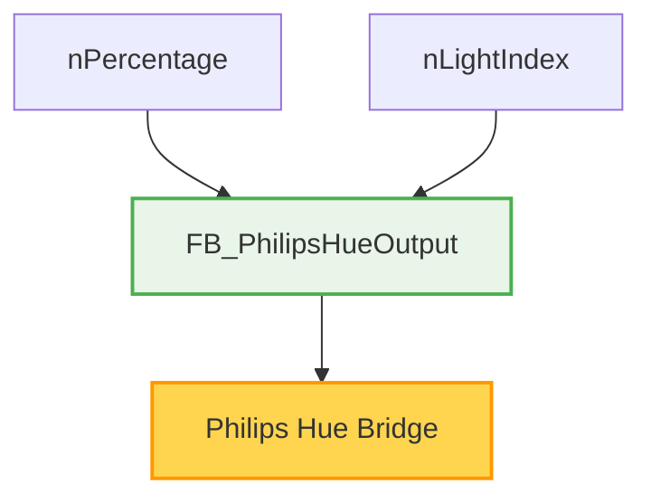
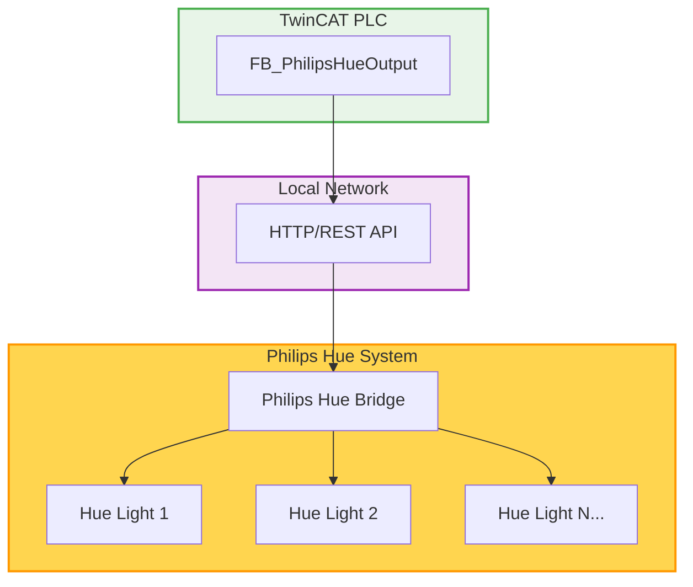

# TwinCAT Philips Hue Integration

> **Note:** This is a personal project, completely separate from my work at Beckhoff. It is not an official Beckhoff product and receives no official support. I created this for my own home automation needs and decided to share it in case others find it useful.

## Table of Contents

- [FB_PhilipsHueOutput](#fb_philipshueoutput---comprehensive-philips-hue-light-control)

## FB_PhilipsHueOutput - Comprehensive Philips Hue Light Control

The `FB_PhilipsHueOutput` function block provides a complete solution for controlling Philips Hue lights from TwinCAT. It handles bidirectional communication, automatic state synchronization, and intelligent request timing to prevent API rate limiting.

- Complete light control with percentage-based brightness (0-100%)
- Automatic state synchronization with periodic GET requests
- Intelligent phase offset timing to distribute API calls across multiple lights
- Shared HTTP client for memory efficiency
- Built-in error handling and state recovery
- HMI integration support with TcHmiSymbol attributes

### Function Block Declaration

```pascal
FUNCTION_BLOCK FB_PhilipsHueOutput
VAR_INPUT
    { attribute 'TcHmiSymbol.AddSymbol' }
    nPercentage     : UINT(0..100);      // Desired brightness percentage
    nLightIndex     : UINT(1..63);       // Philips Hue light index (1-63)
END_VAR
```

### Features

- **Smart Timing**: 10-second startup delay + distributed phase offsets prevent network congestion
- **State Synchronization**: Periodic 5-minute GET requests keep PLC in sync with external changes
- **Memory Efficient**: Single shared HTTP client for all light instances
- **Rate Limiting**: Intelligent request spacing prevents Philips Hue API overload
- **Error Recovery**: Automatic rollback to last known good state on failed requests

### Usage Example

```pascal
VAR
    hueLight1        : FB_PhilipsHueOutput;
    hueLight2        : FB_PhilipsHueOutput;
    lightBrightness  : UINT(0..100);
END_VAR

hueLight1(nPercentage := lightBrightness, nLightIndex := 1);
hueLight2(nPercentage := 75, nLightIndex := 2);  // Fixed 75% brightness
```

### Dependencies

- **FB_PhilipsHueOutput**: Requires `FB_GetPhilipsHueLight`, `FB_PutPhilipsHueLight`
- **System Libraries**: `Tc3_IotBase` for HTTP client functionality
- **Utility Functions**: [`MID2`](https://github.com/vossjannik/twincat-utilities/blob/main/MID2.TcPOU), `FIND2`, `LEN2` for JSON parsing
- **Global Variables**: `GVL.sHueHostName`, `GVL.sHueApiKey`

### Block Diagram



### System Architecture


